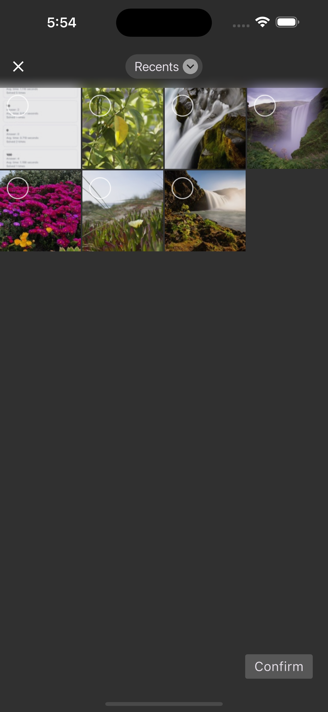

# Media Time Machine
    

사진과 동영상의 잘못된 시간(날짜) 기록을 쉽게 수정하도록 도와주는 도구입니다.

## Features

  

- 개수 제한 없이 이미지 또는 영상을 선택
- Year, Month, Day, Hour, Minute, Second 중 원하는 값만 변경 가능
- 특정 값으로 고정하는 것 외에도 값을 더하거나 뺄 수도 있습니다.